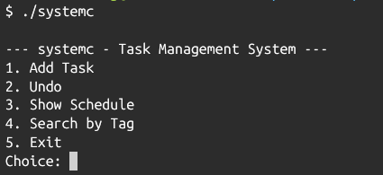

# systemC - CPE112-2568-Project
Mini task scheduler with undo history, with C Programming Language



---

## Origins

We wanted to create a demo of task scheduler, utilizing C Programming Language and Data Structure topics for out final project. The name "systemC" takes inspiration from an init system 'systemd', with a twist of... C language.

## Installation

Clone the repository, run ```make```, and run the binary.

## Members
- Team Lead/Designer/Programmer - Supakorn Huemwang [senni-huemwang](https://github.com/senni-huemwang) (68070503458)
- Programmer/Technical Writer - Mobardas Suwankhamphira [MO](https://github.com/urkovera) (68070503405)
- Programmer/Tester - Alfred Lennard Aquino [hhehasj](https://github.com/hhehasj) (68070503466)
